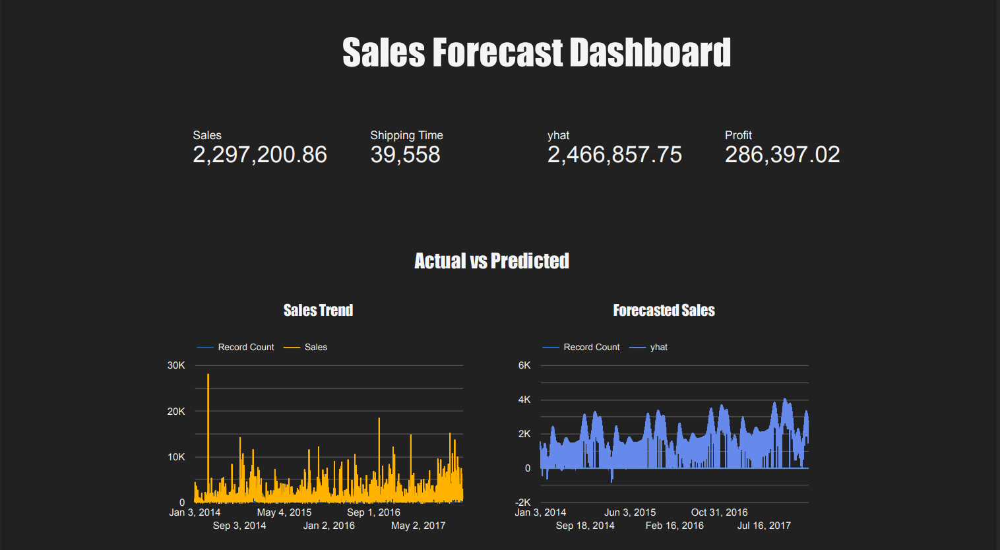

# 📈 AI-Powered Sales Forecasting & Inventory Optimizer

An advanced business analytics project that combines **time series forecasting using Prophet (Python)** with an **interactive Power BI dashboard**. Designed to help businesses predict future sales trends and make smart, data-driven inventory decisions.

---

## 📌 Objective

To forecast monthly sales using historical data and provide business insights via dashboards to optimize inventory and improve operational planning.

---

## 🛠 Tools & Technologies

| Tool/Technology      | Purpose                                |
|----------------------|-----------------------------------------|
| Python (Prophet)     | Time Series Forecasting                 |
| Power BI             | Interactive Dashboards & Drilldowns     |
| Pandas               | Data Cleaning & Preprocessing           |
| Matplotlib/Seaborn   | Forecast Visualization (Python)         |

---

## 📁 Folder Structure


---

## 📊 Dashboard Preview



---

## 📌 Key Insights

✅ **Forecast vs Actual Sales** (2014–2018)  
✅ **Total KPIs**: Sales (2.30M), Profit (286K), Quantity (38K)  
✅ **Prophet Forecasting Model**: Accurate monthly trend prediction  
✅ **Profit Drilldown**: Category → Segment-level insights for inventory and product strategy  
✅ **Data-Driven Inventory Decisions**: Predict stock needs ahead of time


🙋‍♂️ Author
Mehfil
🎓 B.Tech in Artificial Intelligence & Data Science
📊 Data Analyst | Business Analytics Enthusiast
📍 Based in India | Seeking roles in UAE

---

## 📈 Prophet Forecasting Code Snippet

```python
from prophet import Prophet

# Prepare Data
df = df[['Order Date', 'Sales']]
df.columns = ['ds', 'y']

# Model & Forecast
model = Prophet()
model.fit(df)
future = model.make_future_dataframe(periods=6, freq='M')
forecast = model.predict(future)

# Visualize
model.plot(forecast)


